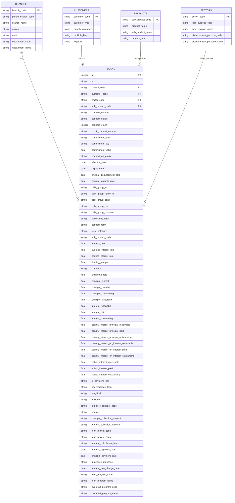

# Database Schema - Entity Relationship Diagram

## Entity Descriptions

### 1. **BRANCHES**
- Stores branch/department information
- Each branch can have multiple loans
- Hierarchical structure with parent branches

### 2. **CUSTOMERS**
- Customer master data
- Priority and type classifications
- Each customer has exactly one loan/contract (1:1 relationship)

### 3. **PRODUCTS**
- Loan product catalog
- Product types and sub-products
- Linked to loan records

### 4. **SECTORS**
- Economic sectors and loan purposes
- Disbursement purpose classifications
- Used for loan categorization

### 5. **LOANS** (Main Transaction Table)
- Central table containing all loan transactions
- Foreign keys to: branches, customers, products, sectors
- Contains financial data:
  - Principal amounts (current, overdue, outstanding, disbursed)
  - Interest details (receivable, paid, outstanding)
  - Penalty interest (on principal and on interest)
  - Interest rates (base, overdue, floating)
  - Date information (normalized to YYYY-MM-DD format)
  - Contract and commitment details
  - Account and payment information

## Relationships

- **One-to-Many**: Each branch, product, and sector can have multiple loans
- **One-to-One**: Each customer has exactly one loan/contract
- **Foreign Keys**: Loans table references all four master tables
- **Referential Integrity**: Ensures data consistency across tables
